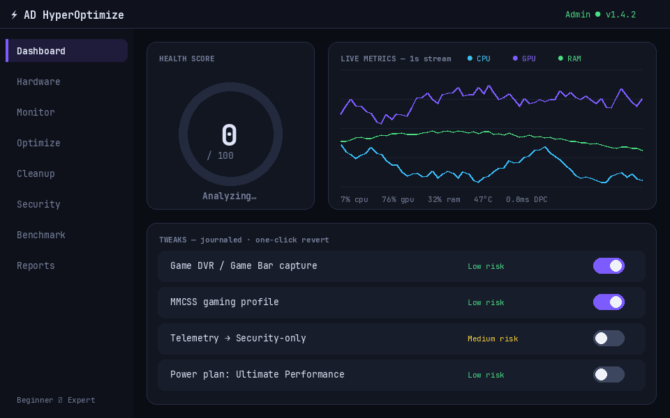

<div align="center">



# ⚡ AD HyperOptimize

**Windows optimization that tells the truth.**
No registry-cleaner snake oil. Only documented, measurable tweaks — journaled, backed up and revertible with one click.

[](https://github.com/zCrxticxl/ad-hyperoptimize/stargazers)
[](LICENSE)
[](https://github.com/zCrxticxl/ad-hyperoptimize/commits)
[](https://discord.gg/GPcTdABdcY)




<sup>UI preview — health scoring, 1s live metrics stream, journaled tweaks with one-click revert</sup>

</div>

## License, security & commercial use

This project is source-available under the included non-commercial license. Personal and other non-commercial use is allowed; commercial use, redistribution in paid offerings, and enterprise deployment need a separate agreement. See [COMMERCIAL-LICENSING.md](COMMERCIAL-LICENSING.md). Security reports are handled under [SECURITY.md](SECURITY.md); please do not report vulnerabilities publicly.

---

## Why another optimizer?

Because most Windows "optimizers" are placebo generators. AD HyperOptimize takes the opposite approach:

| 🚫 Typical optimizer | ✅ AD HyperOptimize |
|---|---|
| "Cleans" the registry | Only documented, measurable tweaks (MMCSS, Game DVR, power plans, telemetry policy…) |
| Changes things silently | Per-tweak confirm with **what / why / impact / risk / reversibility** |
| No way back | Write-ahead journal + `.reg` backups + restore points — **everything reverts** |
| Phones home | **Zero telemetry.** Security page is read-only |

## ✨ Features

- 🩺 **Health Score** — rule-based findings engine scans WMI, SMART, boot, event logs, DNS & network and turns it into one score with concrete findings
- 📊 **Live Monitor** — 1-second real-time metrics stream (CPU, GPU, RAM, disk, temps) straight into the dashboard
- 🎮 **Gaming tweaks** — MMCSS profile, Game DVR/Game Bar, power plans, latency-focused options. Built by someone who plays comp R6, not a checkbox farm
- 🧹 **Cleanup** — whitelisted cache/temp roots only; locked files skipped, never forced
- 🛡️ **Security audit** — Defender, firewall, unsigned drivers, autoruns, hosts file — read-only
- 🏁 **Benchmarks** — CPU / memory / disk with history
- 📄 **Reports** — dark-mode HTML + JSON exports (print → PDF)
- 🔰 **Beginner ⇄ Expert mode** — same engine, two levels of detail

## 🛟 Safety model (the important part)

Every tweak goes through the same pipeline:

```
confirm → restore point (medium risk) → .reg backup → write-ahead journal → apply → verify
                                                          └── failure? auto-rollback ──┘
```

1. **Write-ahead journaling** — previous values are captured to `journal.json` *before* anything is mutated. Failed applies roll back automatically.
2. **Registry backups** — every touched key exported via `reg.exe` first.
3. **Restore points** — one click, surfaced before medium-risk tweaks.
4. **Least privilege** — runs as standard user; asks for admin only where required. Tauri capabilities expose no FS/network surface to the webview.

## 📥 Get it

Grab the latest installer (`.exe` / `.msi`) from [**Releases**](https://github.com/zCrxticxl/ad-hyperoptimize/releases) — or build from source below.

> Releases include `SHA256SUMS.txt` for installer verification. Windows Authenticode signing activates automatically once the repository's signing secrets and timestamp URL are configured; until then, unsigned builds can trigger SmartScreen ("More info" → "Run anyway"). See [CODE_SIGNING.md](CODE_SIGNING.md).

## 🔨 Build from source

<details>
<summary><b>Prerequisites & build steps</b></summary>

1. [Rust](https://rustup.rs) (MSVC toolchain: `rustup default stable-msvc`)
2. [Node.js 20+](https://nodejs.org)
3. Visual Studio Build Tools — "Desktop development with C++"
4. WebView2 runtime (preinstalled on Win 10/11)

```powershell
git clone https://github.com/zCrxticxl/ad-hyperoptimize.git
cd ad-hyperoptimize
npm install

npm run tauri dev     # dev with hot reload
npm run tauri build   # NSIS .exe + .msi in src-tauri/target/release/bundle/
```

</details>

## 🏗️ Architecture

<details>
<summary><b>Module map</b></summary>

```
src/                      # React + TS frontend
├── App.tsx               # Shell: sidebar, beginner/expert mode, admin badge
├── api.ts                # Typed invoke() wrappers + metrics event stream
└── pages/                # Dashboard, Hardware, Monitor, Optimize,
                          # Cleanup, Security, Benchmark, Reports
src-tauri/src/
├── ps.rs                 # PowerShell/exec bridge (no console flashes)
├── scan.rs               # WMI/SMART/boot/event/DNS/network analysis
├── monitor.rs            # 1s real-time metrics thread → "metrics" events
├── tweaks.rs             # Declarative tweak catalog + apply/revert engine
├── safety.rs             # Restore points, .reg backups, write-ahead journal
├── cleanup.rs            # Whitelisted-roots cache/temp cleaner
├── security.rs           # Defender/firewall/drivers/autoruns/hosts (read-only)
├── bench.rs              # CPU/memory/disk benchmarks + history
├── analysis.rs           # Rule-based findings engine + health score
└── report.rs             # Dark HTML + JSON reports
```

**Extending the catalog:** add one `Tweak {}` block in `tweaks.rs` — status detection, backup, journaling, confirm UI and undo come free.

</details>

## 🗺️ Roadmap

- [ ] ETW / DPC latency tracing (`xperf` integration point exists in `scan.rs`)
- [ ] Crash-dump parsing
- [ ] GPU vendor APIs (NVML / ADL)
- [ ] In-game overlay (transparent Tauri window fed by the metrics stream)
- [ ] Code-signed releases

## 🤝 Community & support

Questions, bug reports, tweak suggestions → [**Discord**](https://discord.gg/GPcTdABdcY) or [open an issue](https://github.com/zCrxticxl/ad-hyperoptimize/issues).

If this saved your frametimes, a ⭐ keeps the project visible.

<div align="center">
<sub>Built with 🦀 + ⚡ by <a href="https://github.com/zCrxticxl">Adrian (zCrxticxl)</a> — also check <a href="https://github.com/zCrxticxl/adhyper-linux">adhyper-linux</a> and <a href="https://github.com/zCrxticxl/adrice">adrice</a></sub>
</div>
