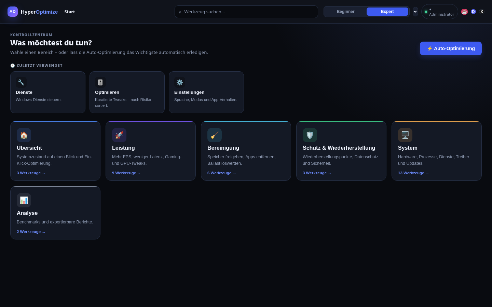
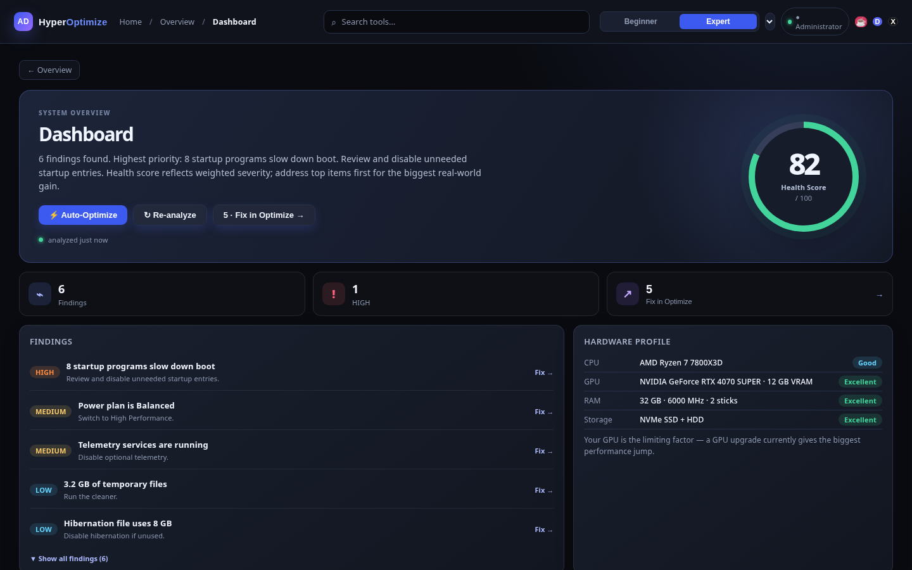
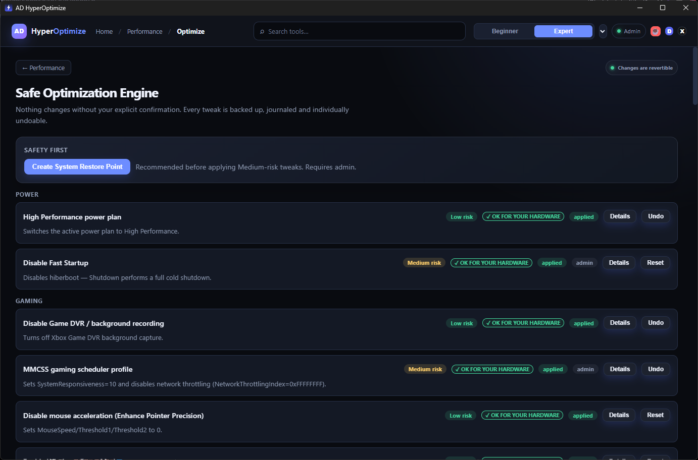
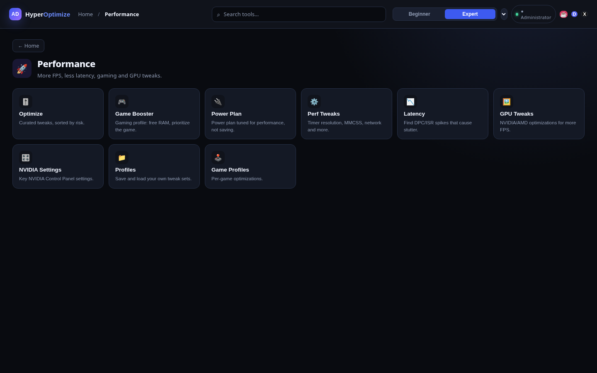

<div align="center">



# ⚡ AD HyperOptimize

**Windows optimization that tells the truth.**
No registry-cleaner snake oil. Only documented, measurable tweaks, journaled, backed up and revertible with one click.

[](https://github.com/zCrxticxl/ad-hyperoptimize/stargazers)
[](LICENSE)
[](https://github.com/zCrxticxl/ad-hyperoptimize/commits)
[](https://discord.gg/vFaKsVuxKP)

<a href="https://www.buymeacoffee.com/zCrxticxl"></a>




<sup>The v1.4 dashboard. Pick a category; every tool explains itself.</sup>

<table>
<tr>
<td width="50%"></td>
<td width="50%"></td>
</tr>
<tr>
<td width="50%"></td>
<td width="50%"><sub>Health score and findings, the journaled tweak engine with per-tweak risk and undo, and category navigation. Every screenshot is the real app, not a mockup.</sub></td>
</tr>
</table>

</div>

## License, security & commercial use

This project is source-available under the included non-commercial license. Personal and other non-commercial use is allowed; commercial use, redistribution in paid offerings, and enterprise deployment need a separate agreement. See [COMMERCIAL-LICENSING.md](COMMERCIAL-LICENSING.md). Security reports are handled under [SECURITY.md](SECURITY.md); please do not report vulnerabilities publicly.

---

## Why another optimizer?

Because most Windows "optimizers" are placebo generators. AD HyperOptimize takes the opposite approach:

| 🚫 Typical optimizer | ✅ AD HyperOptimize |
|---|---|
| "Cleans" the registry | Only documented, measurable tweaks (MMCSS, Game DVR, power plans, telemetry policy…) |
| Changes things silently | Per-tweak confirm with **what / why / impact / risk / reversibility** |
| No way back | Write-ahead journal + `.reg` backups + **exact captured-state undo**, tweaks restore to their prior value, not a guess |
| Phones home | **Zero telemetry.** Nothing is sent online |

## ✨ Features

**Overview**
- 🩺 **Health Score**, rule-based findings engine scans WMI, SMART, boot, event logs, DNS & network and turns it into one score with concrete findings
- ⚡ **Auto-Optimizer**, applies the recommended low-risk tweaks in one click, with a real risk label per item and a confirmation step
- 🩺 **Health Check**, SFC / DISM / component scans with honest result states

**Performance**
- 🎮 **Optimize**, the journaled tweak engine: every tweak shows risk, hardware check, impact, reversibility; undo is one click (HAGS, power plans, Game DVR, MMCSS…)
- 🎮 **Game Booster / Quick Boost**, priority/affinity + power plan + HAGS snapshot with an independent per-run restore token
- 🔌 **Power Plans**, set / create / delete / unlock Ultimate, per-scheme
- ⚙️ **Perf Tweaks**, timer resolution, MSI mode, network adapter tweaks, RAM standby flush, pagefile
- 📉 **Latency Analyzer**, DPC/ISR counters, stall probe, and full **WPR** deep-trace recording
- 🖼️ **GPU Tweaks**, NVIDIA/AMD driver-key tweaks with hardware-aware risk gating
- 🎛️ **NVIDIA Settings**, direct control-panel value tweaks
- 📁 **Profiles**, curated tweak bundles (with optional before/after benchmark)
- 🕹️ **Game Profiles**, per-game presets + auto power-plan switcher

**Cleanup**
- 🧹 **Cleanup**, whitelisted cache/temp roots only; locked files skipped, never forced
- 🗑️ **Uninstaller**, remove apps and scan/clean leftovers (validated paths only)
- 💾 **Disk Analyzer**, largest files, duplicates (SHA-256), old temp files, auto-organize
- 📦 **Debloater**, telemetry/ads/UX registry tweaks + preinstalled UWP removal, with exact capture/restore
- 🗂️ **Registry Cleaner**, dead-entry scan with real `.reg` backups and a **Restore…** panel
- 🖱️ **Context-Menu Cleaner**, remove bloat entries from the Explorer context menu

**Protection**
- 🛟 **Restore Points**, create / list / delete, or launch the system tool
- 🕵️ **Privacy Center**, telemetry, advertising ID, activity history, location… with per-item undo
- 🔒 **Security Center**, audits Defender, firewall, unsigned drivers, autoruns and the hosts file, and offers **explicit, opt-in** controls to change them. Nothing changes without a click.

**System**
- 🧩 **Hardware**, specs, boot-time analysis, SMART disk health
- 📈 **Live Monitor**, 1-second CPU / RAM / network / disk metrics
- 🌡️ **HW Monitor**, CPU/GPU temperatures (nvidia-smi), S.M.A.R.T., fans (10 s refresh)
- 📑 **Process Manager**, list / kill / priority / affinity / persistent priorities
- 🚦 **Startup**, run-key + folder entries, reversible toggles
- 🔧 **Services**, bloat-aware service audit, startup type + start/stop
- ⏰ **Scheduled Tasks**, disable/enable bloat tasks
- 💿 **Drivers**, list, age/unsigned flags, winget + Windows Update installs
- 🥾 **Boot Optimizer**, bcdedit tweaks with exact undo
- 🔄 **Updates**, winget app updates + Windows Update driver installs
- 📥 **Software Installer**, curated winget catalog with live per-app status
- 🛠️ **PC Configurator**, hardware bottleneck analysis + build/upgrade guidance
- ⚙️ **Settings**, language, Beginner/Expert mode, clear scan cache

**Analysis**
- 🏁 **Benchmarks**, CPU / memory / disk with history
- 📄 **Reports**, dark-mode HTML + JSON exports and the full change journal

**Navigation & search**
- 🔍 **Feature search**, type a tweak, service, task or tool name (e.g. "HAGS", "DiagTrack") and jump straight to it, highlighted. Searches across every toggleable feature.
- 🕘 **Recently used**, quick access to your last tools on the home screen
- ⌨️ **Keyboard**, `/` focuses the search, `Esc` clears it
- 🔰 **Beginner ⇄ Expert mode**, same engine, two levels of detail

## 🛟 Safety model (the important part)

Every tweak goes through the same pipeline:

```
confirm → (recommended: restore point) → .reg backup → write-ahead journal → apply → verify
                                                          └── failure? auto-rollback ──┘
```

1. **Write-ahead journaling**, previous values are captured to `journal.json` *before* anything is mutated. Failed applies roll back automatically.
2. **Registry backups**, every touched key exported via `reg.exe` first.
3. **Exact captured-state undo**, where a change can be snapshotted, the prior state (registry value, service start type, power plan, toast setting) is captured to a state file and restored exactly on undo, never a guessed default. This powers the Debloater, Game Boost and Quick Boost.
4. **Restore points**, one click, surfaced before medium-risk tweaks.
5. **Runs elevated**, most system tweaks need administrator rights, so the app requests elevation at launch (UAC). The webview is granted no direct filesystem/HTTP plugin access; opening files/URLs goes only through a validated `cmd_open_path`, and network is limited to the built-in updater.

## 📥 Get it

Grab the latest installer (`.exe` / `.msi`) from [**Releases**](https://github.com/zCrxticxl/ad-hyperoptimize/releases), or build from source below.

> Releases include `SHA256SUMS.txt` for installer verification. Windows Authenticode signing activates automatically once the repository's signing secrets and timestamp URL are configured; until then, unsigned builds can trigger SmartScreen ("More info" → "Run anyway"). See [CODE_SIGNING.md](CODE_SIGNING.md).

## 🔨 Build from source

<details>
<summary><b>Prerequisites & build steps</b></summary>

1. [Rust](https://rustup.rs) (MSVC toolchain: `rustup default stable-msvc`)
2. [Node.js 20+](https://nodejs.org)
3. Visual Studio Build Tools, "Desktop development with C++"
4. WebView2 runtime (preinstalled on Win 10/11)

```powershell
git clone https://github.com/zCrxticxl/ad-hyperoptimize.git
cd ad-hyperoptimize
npm install

npm run tauri dev     # dev with hot reload
npm run tauri build   # NSIS .exe + .msi in src-tauri/target/release/bundle/
```

</details>

## 🏗️ Architecture

<details>
<summary><b>Module map</b></summary>

```
src/                      # React + TS frontend
├── App.tsx               # Shell: topbar + category launcher, search, mode, recents
├── api.ts                # Typed invoke() wrappers + metrics event stream
├── pages/                # 36 tool pages (Dashboard, Optimize, Security, Debloater, …)
└── components/           # ui primitives, HwWarnings, Onboarding

src-tauri/src/
├── ps.rs                 # PowerShell/exec bridge (timeouts, no console flashes)
├── lib.rs                # Tauri commands, admin-relaunch, command wiring
├── scan.rs               # WMI/SMART/boot/event/DNS/network analysis
├── monitor.rs            # 1s real-time metrics thread → "metrics" events
├── analysis.rs           # Rule-based findings engine + health score
├── tweaks.rs             # Declarative tweak catalog + apply/revert engine
├── safety.rs             # Restore points, .reg backups, write-ahead journal
├── cache.rs              # Persistent scan cache
├── cleanup.rs            # Whitelisted-roots cache/temp cleaner
├── security.rs           # Defender/firewall/drivers/autoruns/hosts
├── regclean.rs           # Registry orphan scan + .reg backup/restore
├── debloater.rs          # Registry tweaks (capture/restore) + UWP removal
├── gameboost.rs          # Game/Quick Boost with per-run restore token
├── gameprofile.rs        # Per-game presets + auto power-plan switcher
├── gputweaks.rs          # GPU driver-key tweaks
├── bootopt.rs            # bcdedit tweaks
├── perftweaks.rs         # timer / MSI / network / RAM / pagefile
├── powerplan.rs          # power plan list/set/create/delete
├── latency.rs            # DPC/ISR counters + WPR recording
├── bench.rs              # CPU/memory/disk benchmarks + history
├── hwmonitor.rs          # temps / S.M.A.R.T. / fans
├── hwprofile.rs          # hardware detection + warnings
├── diskanalyzer.rs       # largest/duplicates/temp-age/organize
├── procmgr.rs            # process kill/priority/affinity
├── startup.rs            # startup entries
├── services.rs           # services + bloat audit
├── schedtasks.rs         # scheduled tasks
├── drivers.rs            # driver list + winget/pnputil/WU
├── updates.rs            # winget app + WU driver updates
├── softwareinstaller.rs  # curated winget catalog
├── uninstaller.rs        # uninstall + validated leftover clean
├── ctxmenu.rs            # context-menu cleaner
├── privacy.rs            # privacy/telemetry tweaks
├── autoopt.rs            # auto-optimizer
├── healthcheck.rs        # SFC/DISM runner
├── profiles.rs           # tweak bundles
├── report.rs             # Dark HTML + JSON reports
└── procmgr.rs / gamedb.rs / hardware helpers…
```

**Extending the catalog:** add one `Tweak {}` block in `tweaks.rs`, status detection, backup, journaling, confirm UI and undo come free.

</details>

## 🗺️ Roadmap

- [x] **ETW / DPC latency tracing**, per-core DPC/ISR counters + full `wpr.exe` deep-trace recording (`latency.rs`)
- [x] **Code-signed releases**, conditional Authenticode signing in the release workflow
- [ ] Crash-dump parsing (currently only lists `Minidump` files)
- [ ] GPU vendor APIs (NVML / ADL), today via `nvidia-smi` CLI + WMI
- [ ] In-game overlay (transparent Tauri window fed by the metrics stream)

## 🤝 Community & support

Questions, bug reports, tweak suggestions → [**Discord**](https://discord.gg/vFaKsVuxKP) or [open an issue](https://github.com/zCrxticxl/ad-hyperoptimize/issues).

If this saved your frametimes, a ⭐ keeps the project visible.

<div align="center">
<sub>Built with 🦀 + ⚡ by <a href="https://github.com/zCrxticxl">Adrian (zCrxticxl)</a>, also check <a href="https://github.com/zCrxticxl/adhyper-linux">adhyper-linux</a> and <a href="https://github.com/zCrxticxl/adrice">adrice</a></sub>
</div>
